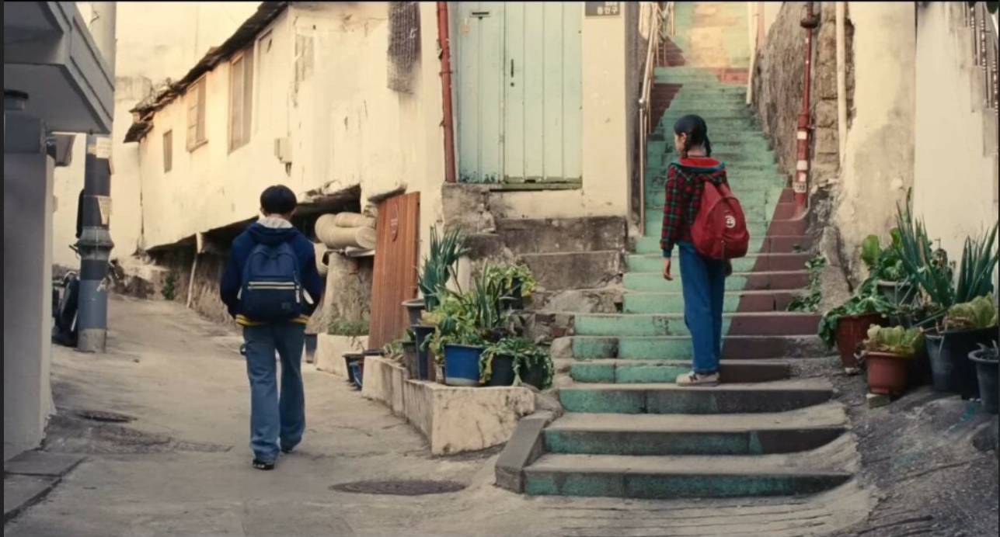

+++
title = "Saying Goodbye to Yourself (Past Lives)"
date = 2026-02-21
+++

_Past Lives_ is a film about the grief of commitment, the commitment to this grief, and human finitude.
At age 12 Na Young, renamed Nora, emigrates from Korea to Canada, leaving behind her childhood friend and crush Hae Sung.
When asked why she wants this, Nora says it is because no one from Korea wins the Nobel prize for literature.
At age 24, the two reconnect over Skype for most of a year, Nora now writing for theatre in New York City, and Hae Sung still living in Seoul.
While their chemistry is immediately apparent to them both, Hae Sung also stands in for the life in Korea Nora left.
She implies as much when effectively breaking up with Hae Sung on the eve of a writer's retreat, expressing a need to move on with her life and career.
Another twelve years pass and Hae Sung travels to New York to see Nora in person for the first time since they were 12.

It is a mature[^mature] love story in that Nora affirms the choices she has made.
(I'd say she even affirms as her choice the contingent situation whereby she has come to love and marry Arthur.)
Her affirmation takes the form of grieving what those choices necessarily exclude: a life in Korea (on this, see [Jae-ha Kim in Salon](https://www.salon.com/2024/03/08/past-lives-inyeon-melancholy/)), or perhaps in Canada where her family still lives, and a life with Hae Sung.
By the end of the film, it is clear that Nora and Hae Sung occupy incompatible worlds.
The romantic tension and lasting longing between the two fills the many spaces that conspicuously separate them; and it fills the silence between sentences when they speak and the dozen years between reconnections.
But this is precisely what they mean to one another: unfulfilled desire (which is a redundant way to say desire).
Tension is the effect of what structures their respective lives, like the tension that holds a bridge suspended from cables strung between towers.
To break the tension by acting on it would dissolve that structure and eliminate the meaning that defines their connection.
Thus their reunion is a meditation not on regret at what could have been but on the loss necessitated by the fulfillment of personal dreams and a life well lived.
The longing stares come to express appreciation for the past they share because of its role in the presents they do not.
Nora and Hae Sung do not reject one another either.
Rather, their unrequited longing means they remain faithful to their desire.

Through "inyeon," there is a way to read the film as offering a redemption of this suspended consummation.
A central concept of the film, inyeon refers to the accumulated interactions of two persons' past lives that amount to a romantic connection.
When Nora meets Arthur at the writers' retreat, she introduces him to the concept.
And when Hae Sung has a moment alone with Arthur, Hae Sung says to him that he and Nora have a lot of inyeon.
The double implication, which is finally made explicit by Hae Sung in the film's last scene, is that Nora is with Arthur in this life due to destiny, but that Hae Sung and Nora will, in some as yet unrealized future manifestation of themselves, be together.
The planet-spanning tension will be resolved, the global dispersion of their social roles surmounted.
I don't fully disagree with this, as I think Hae Sung wants to believe it, but it does undercut Nora's affirmation of her life as I see it presented by the film.

The concluding goodbye scene stages this difference in how the two view their "inyeon."
Hae Sung wonders whether they are already living the past lives of a future version of themselves, contributing to the inyeon that will make them be "something else to each other."
He asks Nora who she thinks they are then, to which she says, "I don't know."
("Me neither," he replies.)
Hae Sung's final line: "See you then," to which Nora says nothing.[^maybe]
Whereas Hae Sung seems committed to the future that will redeem their unrequited connection, Nora's ambivalence expresses a fuller commitment to the present, to this life the past lives she herself lived in order to arrive at this life.

The most intense element of the goodbye scene is the subtly reimagined flashback to when they last saw each other in Korea.
It's cut into the scene right after Hae Sung turns from the car that will take him to the airport and says “Hey!”
When the scene referenced by the flashback actually happens early in the film, the two kids are walking home during the day after school.
Young Nora, as if already moved on to her next life in Canada, begins to walk up the steps to the right without ceremony.
Hae Sung calls to her (“Hey!”), she turns around (“What?”), and we see Hae Sung from her perspective (“Bye”) before returning to the perspective that watches them walk their forked paths.
As a flashback, Na young (adult Hae Sung uses Nora's Korean name in the present) stands on the first step looking at Hae Sung, who also stands just left of center staring back.
It is night.

The subtle changes to the shot do more than emphasize the echo of that first goodbye in the present.
In an inversion of inyeon's temporality, which is explained as being directed from past to future, here their interaction effects the past, as if the choices yet to come relative to the 12-year-olds' goodbye were needed to determine the meaning of that past life.
What seems like a flashback is instead symbol of simultaneity wherein the lives separated by twenty-four years coincide.
Young Hae Sung and Na Young are presented as a still life.
With the still life, cinema collapses the temporal distance of two lives' movement into a time-image: a bit of time in its pure state.[^cinema2]
The two scenes are one and the same goodbye.
More than a reversal, temporality takes on a bidirectional mutuality here, with the first goodbye virtually present in the second, and the second in the first, each the other's past.
Together they form what Deleuze calls a "crystal-image," a crystal of time in which the splitting into past and new present is held in suspense.
Past and present coalesce in the interstitial childhood goodbye shot, concentrating the pre-subjective potential out of which Nora and Hae Sung will be determined into a direct presentation.

Inyeon is throughout the film invoked as a personal diachronic counterweight to the global synchronic.
(Recall the Nobel prize line: the spatial dimension of Nora's life is dictated by Euro-American cultural hegemony.)
The possibilities for how one's life story could go are so ramified by the simultaneity of place as to demand a temporal resource, a supra-historical force of fate, to help explain and redeem the actual story.
But in the end, this conception of inyeon turns out to be time spread over the immensity of space, a way to make-do with the conditions that thwart one's desires in the present.
Subjectivity is subordinated to the contingencies of distance.

The goodbye scene, however, recasts inyeon as a fully present operation.
The flashbacks to their date as 12-year-olds and the image of the parting fork on the path home stabilize a subjective time fractured by its global becoming-space.
But, again, there is no final redemption of this incommensurability.
The loss of Nora's Korean life is definitive, the bifurcation from its trajectory permanent.
The idea of inyeon as destiny (and thus as a guiding power as great or greater than that of the spatial immensity of a globalized planet) transforms into a personally scaled experience of the co-presence of the past with the present.
Through this concluding presentation, which consolidates rather than mends fractured subjective time, the film affirms a disjointed, incomplete unity of Nora's lives.
The film is all the more beautiful and intense for its preservation of the disharmony between them.

[^mature]:
    Maturation is a movement of determination from potential to actual.
    Determination is negation: it entails the selection of detail, a definitive arrangement of one's world, the exclusion of incompatibilities, the atomization of the continuous.
    By contrast, the immature is inchoate, still open, indefinite.
    Maturity evokes an acceptance of one's own choices as having already passed.
    The mature outlook assents to the decisions inherited, whereas childishness sustains an orientation rooted in the present.
    The child wants what they want now.
    This is not a morally wrong position but, rather, a way of naming two orientations towards personal history.

[^maybe]: I misremembered Nora saying "maybe" to Hae Sung's "See you then." So either the meaning of this scene was so effective that I read into Nora's silence how her ambivalence would have responded, or I am so attached to this interpretation that I am misreading the scene entirely.

[^cinema2]: Gilles Deleuze, _Cinema, 2: The Time-Image_, trans. Hugh Tomlinson and Robert Galeta, University of Minnesota Press 1989, 17.
