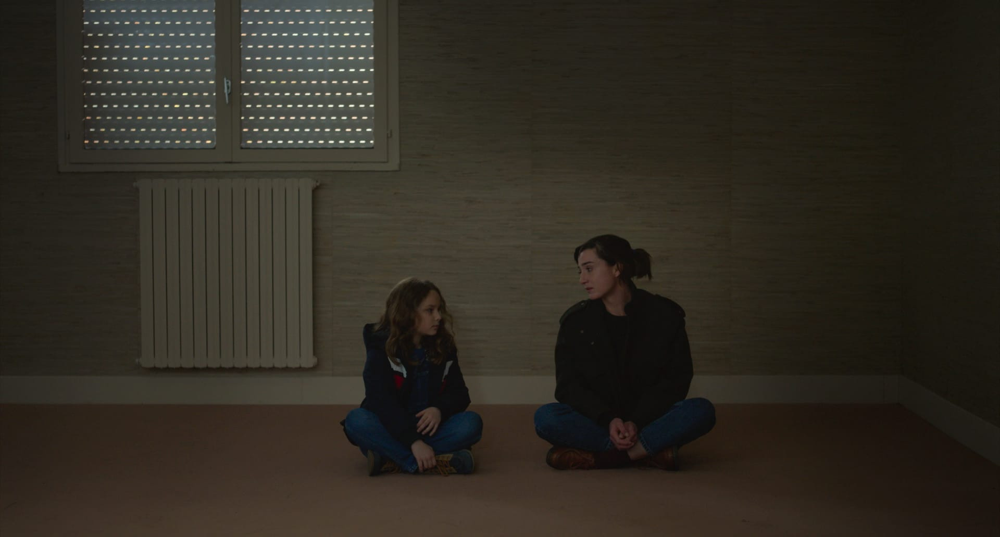

+++
title = "On the Truth of Recognition and Love in Petite Maman's Ending"
date = 2025-05-14
+++

In the final scene of Céline Sciamma's _Petite Maman_, Nelly finds her mother sitting cross-legged on the floor of her now emptied childhood home.
The mother's eight-year-old self left for her operation that afternoon, and, in a reversal of her child self's appearance, the adult returns in the child's absence.
Perhaps some viewers might have wondered at this moment whether the mother would show sign of a memory of spending time with her daughter from the future.
But this is not that kind of time travel narrative.
_Petite Maman_ is not interested in the mechanics of time travel continuity.
For the characters, it simply is the case; they do not ponder the ramifications of this passage; they barely even wonder in its happening.
Rather, the wonder comes entirely from them spending time together.
The time travel conceit is merely what allows for the presentation of two people occupying the same time in their lives for a couple of days.
More than a continuity of personal history, we are meant to identify the two ages of Marion as one person.

The concluding scene affirms the insignificance of literal time travel for the film.
It confers a unity of feeling and significance on the work as whole.
This retroactivity might, upon initial viewing, seem like an act of time travel in its own right.
But it is not: it does not reach back into the past of the film and change how we think and feel about its events.
It simply completes the vision.

Nelly sits beside her mother, who apologizes for leaving, and Nelly says it's fine, "it was nice".
Then Nelly turns to her mother and says her name: "Marion."
Marion smiles with the surprise one reserves for a child who knows more than expected, who says more than their age should allow.
Her look at the same time recognizes Nelly's address as coming from a friend.
They embrace, and Marion says in reponse, "Nelly."

Marion's response does not indicate that she remembers meeting her future child 23 years prior.
I think it shows a generic (universal) human connection transcending the mother-daughter relationship and adult-child difference even as that connection depends, for its existence as well as for its artistic manifestation, upon the relationship Nelly has with her mother as her child.

Nelly is always shown at ease with adults.
She works with a woman at the nursing home on a crossword, and does the same with her younger grandmother.
She askes her father to share a real memory from his childhood, insisting that she is interested ("J'avais peur de mon père," he offers).
She wants to see the fort her mother built as a child (which Nelly herself ends up helping Marion build).
This could be seen as Nelly longing to know her parents as children her own age.
But I think the lens that views childhood as a separate time and place than adulthood is something the film uses in order to see beyond it.
By depicting characters of such different ages, the contrast between what we expect in such relationships and what occurs intensifies the symbol of connection, of enjoyment with another.

_Petite Maman_'s concluding scene shows two people regarding one another for who they _are_, and not for who they represent _for_ the other.
Had the ending only affirmed motherhood and childhood, perhaps by having Nelly say "maman" instead of "Marion," then I think it would have still been a sweet, touching story about a parent being recognized for her inner child (I mean this insofar as we are in part all the past moments of ourselves sedimented in memory and reanimated anew at each occasion of feeling), which in turn comforts the child in her grief for her grandmother's death.
By meeting her mother as an eight-year-old, as well as her younger grandmother, Nelly processes her grief and perhaps grapples with mortality and the contingencies of life.
And while these are all true of the film as I understand it, those relations are—by virtue of the film's final moment—granted a wider scope.
Because the relationship that is deployed by the film as its finite situation is one so apparently primal and singular as motherhood, when that is transcended by the infinite truth of love created by the two, the latter's presentation is intensified by that contrast.
The mother-daughter relationship is not the relationship that transcends time and remaps space but is, instead, what we suddenly recognize as finite, a situation traversed by a truth, a body for a universal.
